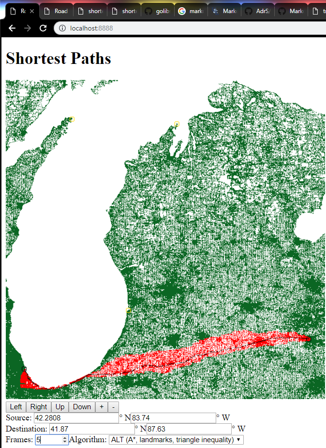
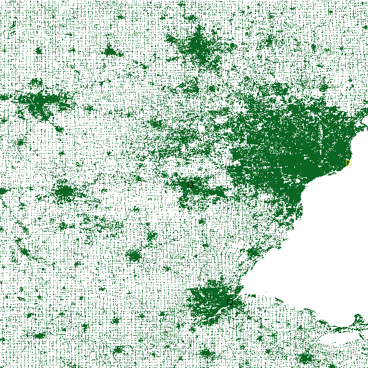
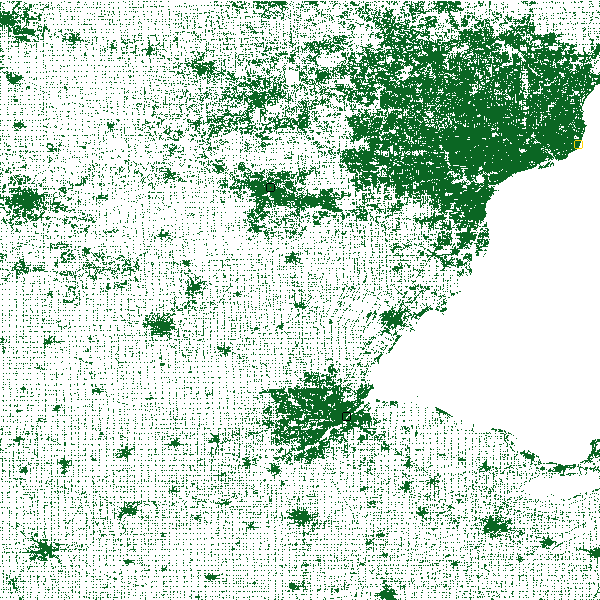
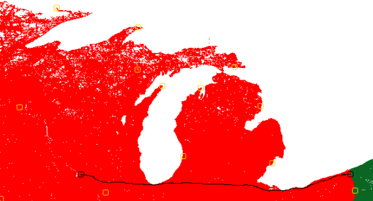
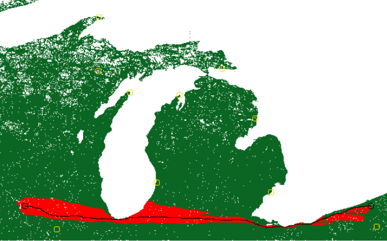

# Point to Point Shortest Path Finder

## About
Written by Adrian Stoll December 5, 2018. [This](https://github.com/AdrS/shortestpath) web app generates animated gifs showcasing the progression of point-to-point shortest path algorithms in a road network. It supports coordinate entry, panning, zooming, and variable length animations. To generate an image without animations, set "frames" to one.

## Algorithms
The app uses either Dijkstra's algorithm or the ALT (A star search, landmarks, triangle inequality) algorithm to find shortest paths. The red points are those inspected during the search. The black circles indicate the start and end points and the black points are those along the optimal path.

The ALT algorithm makes use of special points called landmarks. To select landmarks I use the "farthest" heuristic which picks a point the greatest number of hops from any of the previously selected landmarks. The landmarks are indicated by yellow circles on the map. The ALT algorithm visits dramatically fewer points in a given search making it faster.

## Setup
- Install [go](https://golang.org/doc/install)
- Clone the repository `git clone https://github.com/adrs/shortestpath.git ~/go/src/github.com/adrs/shortestpath`
- Download a road network dataset from [DIMACS](http://www.diag.uniroma1.it/challenge9/download.shtml)
- Compile `cd ~/go/src/github.com/adrs/shortestpath/ && go build`

## Usage
- `usage: ./shortestpath <node file> <vertex file>`
- Start webserver on port 8888 `./shortestpath USA-road-d.LKS.co USA-road-d.LKS.gr`
- Go to [localhost:8888](http://localhost:8888)
- Note: for the Great Lakes map with 16 landmarks, the server requires 1-2GB of ram.

# References
- Computing Point-to-Point Shortest Paths from External Memory - Goldberg, Werneck
- <https://www.cc.gatech.edu/~thad/6601-gradAI-fall2012/02-search-01-Astart-ALT-Reach.pdf>
- <https://www.cs.princeton.edu/courses/archive/spr06/cos423/Handouts/EPP%20shortest%20path%20algorithms.pdf>
- [A Formal Basis for the Heuristic Determination of Minimum Cost Paths - Hart, Nilsson, Raphael](https://www.cs.auckland.ac.nz/courses/compsci709s2c/resources/Mike.d/astarNilsson.pdf)
- <https://www.coursera.org/learn/algorithms-on-graphs>
- Computing the Shortest Path: A\* Search Meets Graph Theory - Andrew V. Goldberg, Chris Harrelson
